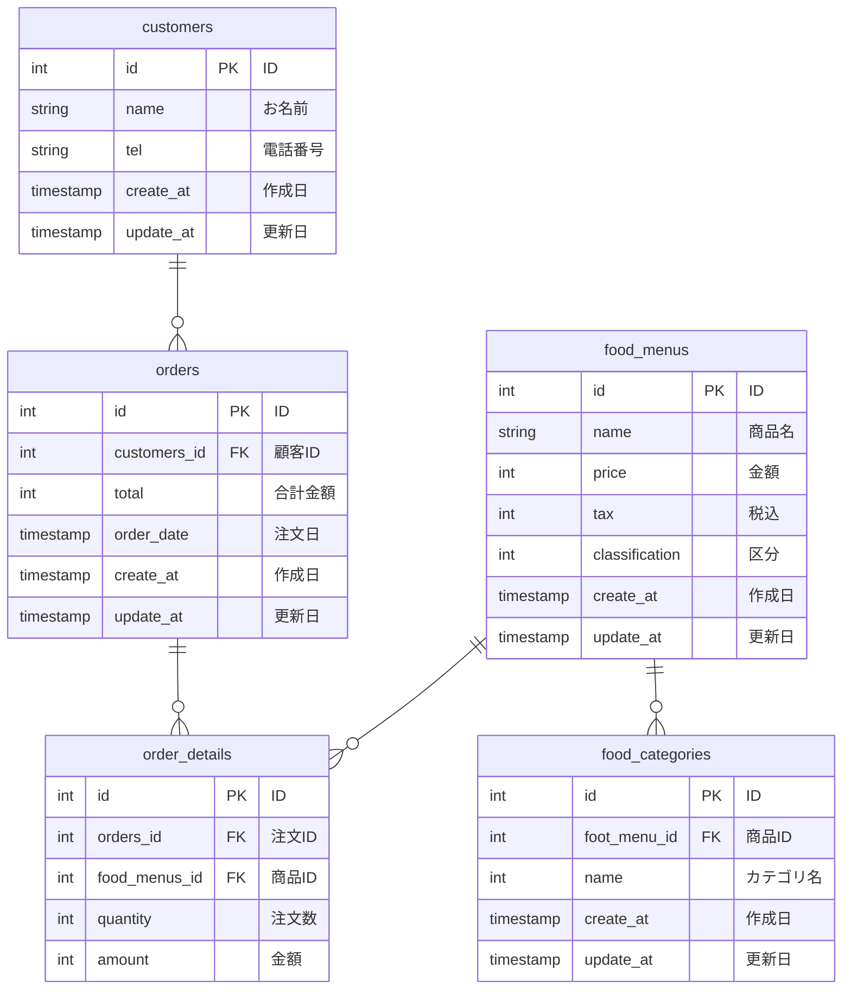

```mermaid
    erDiagram 
        %% 顧客テーブル
        customers {
            int id PK "ID"
            string name "お名前"
            string tel "電話番号"
            timestamp create_at "作成日"
            timestamp update_at "更新日" 
        }

        %% 商品テーブル
        food_menus {
            int id PK "ID"
            string name "商品名"
            int price "金額"
              %% 見落とし
            int tax "税込"
            %% 見落とし 
            int classification "区分"
            timestamp create_at "作成日"
            timestamp update_at "更新日" 
        }

        %% 商品カテゴリテーブル
        food_categories {
            int id PK "ID"
            int foot_menu_id FK "商品ID"
            int name "カテゴリ名"
            timestamp create_at "作成日"
            timestamp update_at "更新日" 
        }

        %% 注文テーブル
        orders{
            int id PK "ID"
            int customers_id FK "顧客ID"
            int total "合計金額"
            timestamp order_date "注文日"
            timestamp create_at "作成日"
            timestamp update_at "更新日" 
        }

        %% 注文明細テーブル
        order_details {
            int id PK "ID"
            int orders_id FK "注文ID"
            int food_menus_id FK "商品ID"
            int quantity "注文数"
            int amount "金額"
        }

        food_menus ||--o{ food_categories: ""
        customers ||--o{ orders: ""
        orders ||--o{ order_details:""
        food_menus ||--o{ order_details:""
```
