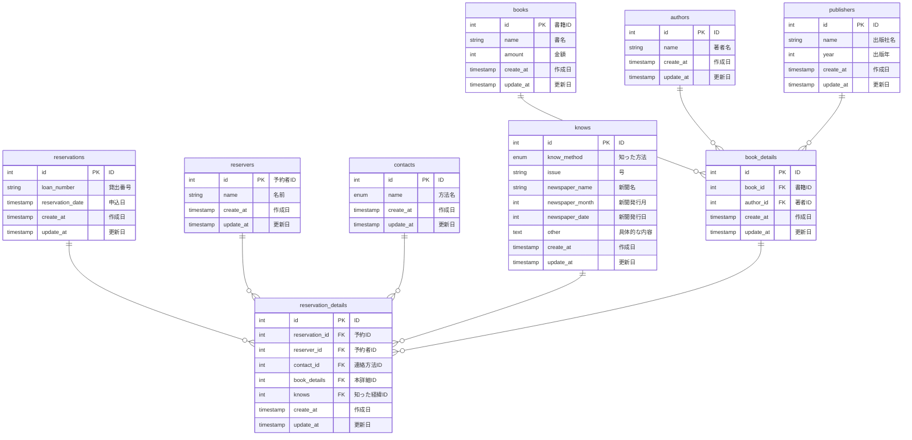

```mermaid
    erDiagram 
        %% 予約テーブル
        reservations {
            int id PK "ID"
            string loan_number "貸出番号"
            timestamp reservation_date "申込日"
            timestamp create_at "作成日"
            timestamp update_at "更新日"
        }

        %% 予約詳細テーブル
        reservation_details {
            int id PK "ID"
            int reservation_id FK "予約ID"
            int reserver_id FK "予約者ID"
            int contact_id FK "連絡方法ID"
            int book_details FK "本詳細ID"
            int knows FK "知った経緯ID"
            timestamp create_at "作成日"
            timestamp update_at "更新日"
        }

        %% 予約者
        reservers {
            int id PK "予約者ID"
            string name "名前"
            timestamp create_at "作成日"
            timestamp update_at "更新日"
        }

        %% 連絡方法テーブル
        contacts{
            int id PK "ID"
            enum name "方法名"
            timestamp create_at "作成日"
            timestamp update_at "更新日"
        }

        %% 書籍テーブル
        books {
            int id PK "書籍ID"
            string name "書名"
            %% 見落とし
            int amount "金額"
            timestamp create_at "作成日"
            timestamp update_at "更新日"
        }

        %% 著者テーブル
        authors {
            int id PK "ID"
            string name "著者名"
            timestamp create_at "作成日"
            timestamp update_at "更新日"
        }

        %% 出版社テーブル
        publishers {
            int id PK "ID"
            string name "出版社名"
            int year "出版年"
            timestamp create_at "作成日"
            timestamp update_at "更新日"
        }

        %% 書籍詳細データテーブル
        book_details{
            int id PK "ID"
            int book_id FK "書籍ID"
            int author_id FK "著者ID"
            timestamp create_at "作成日"
            timestamp update_at "更新日"
        }

        %% 何で知ったか
        knows {
            int id PK "ID"
            enum know_method "知った方法"
            string issue "号"
            string newspaper_name "新聞名"
            int newspaper_month "新聞発行月"
            int newspaper_date "新聞発行日"
            text other "具体的な内容"
            timestamp create_at "作成日"
            timestamp update_at "更新日"
        }

         reservations ||--o{ reservation_details: ""
         reservers ||--o{ reservation_details: ""
         contacts ||--o{ reservation_details: ""
         books ||--o{ book_details: ""
         authors ||--o{ book_details: ""
         publishers ||--o{ book_details: ""
         knows ||--o{ reservation_details: ""
         book_details ||--o{ reservation_details: ""
```
