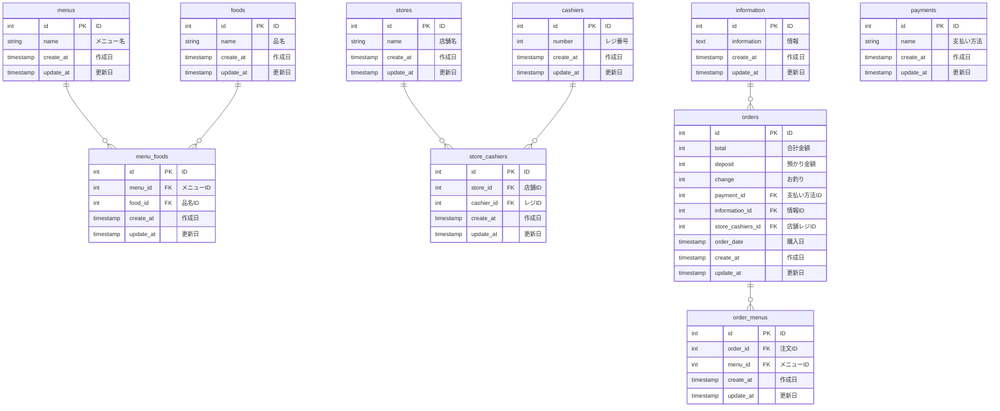

```mermaid
    erDiagram 
        %% メニューテーブル
        menus {
            int id PK "ID"
            string name "メニュー名"
            timestamp create_at "作成日"
            timestamp update_at "更新日"
        }

        %% 品名テーブル
        foods {
            int id PK "ID"
            string name "品名"
            timestamp create_at "作成日"
            timestamp update_at "更新日"
        }

        %% メニュー詳細テーブル
        menu_foods {
            int id PK "ID"
            int menu_id FK "メニューID"
            int food_id FK "品名ID"
            timestamp create_at "作成日"
            timestamp update_at "更新日"
        }

        %% 店舗テーブル　
        stores{
            int id PK "ID"
            string name "店舗名"
            timestamp create_at "作成日"
            timestamp update_at "更新日"
        }

        %% レジテーブル
        cashiers {
            int id PK "ID"
            int number "レジ番号"
            timestamp create_at "作成日"
            timestamp update_at "更新日"
        }

        %% 店舗のレジテーブル（中間テーブル）
        store_cashiers {
            int id PK "ID"
            int store_id FK "店舗ID"
            int cashier_id FK "レジID"
            timestamp create_at "作成日"
            timestamp update_at "更新日"
        }

        %% 情報テーブル　※特売やセールなどを格納
        information {
            int id PK "ID"
            text information "情報"
            timestamp create_at "作成日"
            timestamp update_at "更新日"
        }

        %% 支払い方法
        payments {
            int id PK "ID"
            string name "支払い方法"
            timestamp create_at "作成日"
            timestamp update_at "更新日"
        }

        %% 注文テーブル
        orders {
            int id PK "ID"
            int total "合計金額"
            int deposit "預かり金額"
            int change "お釣り"
            int payment_id FK "支払い方法ID"
            int information_id FK "情報ID"
            int store_cashiers_id FK "店舗レジID"
            timestamp order_date "購入日"
            timestamp create_at "作成日"
            timestamp update_at "更新日"
        }

        %% 注文メニューテーブル （中間テーブル）
        order_menus{
            int id PK "ID"
            int order_id FK "注文ID"
            int menu_id FK "メニューID"
            timestamp create_at "作成日"
            timestamp update_at "更新日"
        }

        menus ||--o{ menu_foods: ""
        foods ||--o{ menu_foods: ""
        stores ||--o{ store_cashiers: ""
        cashiers ||--o{ store_cashiers: ""
        information ||--o{ orders: ""
        orders ||--o{ order_menus: ""
```
