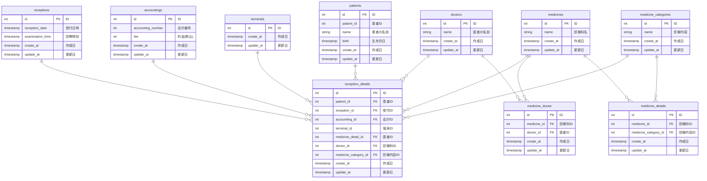

```mermaid
    erDiagram 
        %% 受付テーブル
        receptions {
            int id PK "ID"
            timestamp reception_date "受付日時"
            timestamp examination_time "診察時刻"
            timestamp create_at  "作成日"
            timestamp update_at  "更新日"
        }

        %% 会計テーブル（回答から得たもの）
        accountings {
            int id PK "ID"
            int accounting_number "会計番号"
            int fee "料金(税込)"
            timestamp create_at  "作成日"
            timestamp update_at  "更新日"
        }

        %% 端末テーブル（回答から得たもの）
        terminals {
            int id PK "ID"
            timestamp create_at  "作成日"
            timestamp update_at  "更新日"
        }

         %% 患者テーブル
        patients {
            int id PK "ID"
            int patient_id "患者ID"
            string name "患者の名前"
            %% ↓回答から得たもの
            timestamp birth "生年月日"
            timestamp create_at  "作成日"
            timestamp update_at  "更新日"
        }

         %% 診療科テーブル
        medicines {
            int id PK "ID"
            string name "診療科名"
            timestamp create_at  "作成日"
            timestamp update_at  "更新日"
        }

        %% 診療内容カテゴリテーブル
        medicine_categories {
            int id PK "ID"
            string name "診療内容"
            timestamp create_at  "作成日"
            timestamp update_at  "更新日"
        }

        %% 医者テーブル
        doctors {
            int id PK "ID"
            string name "医者の名前"
            timestamp create_at  "作成日"
            timestamp update_at  "更新日"
        }

        %% 診療科医者テーブル（中間テーブル）
        medicine_doctor{
            int id PK "ID"
            int medicine_id FK "診療科ID"
            int doctor_id FK "医者ID"
            timestamp create_at  "作成日"
            timestamp update_at  "更新日"
        }

        %% 診療科診察内容テーブル（中間テーブル）
        medicine_details{
            int id PK "ID"
            int medicine_id FK "診療科ID"
            int medicine_category_id FK "診療内容ID"
            timestamp create_at  "作成日"
            timestamp update_at  "更新日"
        }

        %% 受付詳細テーブル
        reception_details{
            int id PK "ID"
            int patient_id FK "患者ID"
            int reception_id FK "受付ID"
            int accounting_id FK "会計ID"
            int terminal_id "端末ID"
            int medicine_detail_id FK "医者ID"
            int doctor_id FK "診療科ID"
            int medicine_category_id FK "診療内容ID"
            timestamp create_at  "作成日"
            timestamp update_at  "更新日"
        }

        receptions ||--o{ reception_details: ""
        accountings ||--o{ reception_details: ""
        terminals ||--o{ reception_details: ""
        patients ||--o{ reception_details: ""
        medicines ||--o{ reception_details: ""
        doctors ||--o{ reception_details: ""
        medicine_categories ||--o{ reception_details: ""
        medicines ||--o{ medicine_doctor: ""
        doctors ||--o{ medicine_doctor: ""
        medicines ||--o{ medicine_details: ""
        medicine_categories ||--o{ medicine_details: ""
```
