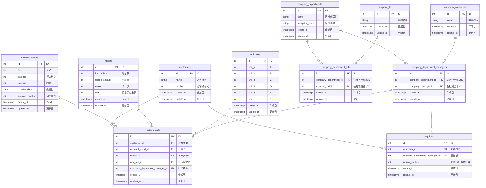

```mermaid
    erDiagram 
        %% お客様テーブル
        customers{
            int id PK "ID"
            string name "お客様名"
            int number "お客様番号"
            timestamp create_at  "作成日"
            timestamp update_at  "更新日"
        }

        %% 口座振替済（？）データテーブル
        account_details{
            int id PK "ID"
            int fee "金額"
            int gas_fee "ガス料金"
            int interest "利息"
            date transfer_date "振替日"
            int account_number "口座番号"
            timestamp create_at  "作成日"
            timestamp update_at  "更新日"
        }

        %% 検針票テーブル
        meters{
            int id PK "ID"
            int instructions "指示数"
            int usage_amount "使用量"
            int meter "メーター"
            int fee "請求予定金額"
            timestamp create_at "作成日"
            timestamp update_at "更新日"
        }

        %% 単位料金
        unit_fees{
            int id PK "ID"
            int unit_a "A"
            int unit_b "B"
            int unit_c "C"
            int unit_d "D"
            int unit_e "E"
            int unit_f "F"
            timestamp create_at "作成日"
            timestamp update_at "更新日"
        }

        meter_details{
            int id PK "ID"
            int customer_id FK "お客様ID"
            int account_detail_id FK "口座ID"
            int meter_id FK "メーターID"
            int unit_fee_id FK "単位料金ID"
            int company_department_manager_id FK "担当者ID"
            timestamp create_at  "作成日"
            timestamp update_at  "更新日"
        }

        %% 会社担当部署テーブル
        company_departments {
            int id PK "ID" 
            string name "担当部署名"
            string reception_hours "受付時間"
            timestamp create_at  "作成日"
            timestamp update_at  "更新日"
        }

        %% 担当者テーブル ※回答から得た
        company_managers{
            int id PK "ID" 
            string name "担当者名"
            timestamp create_at  "作成日"
            timestamp update_at  "更新日"
        }

        %% 担当部署電話番号テーブル
        company_tel{
            int id PK "ID"
            string tel "電話番号"
            timestamp create_at  "作成日"
            timestamp update_at  "更新日"
        }

        company_department_tels{
            int id PK "ID"
            int company_department_id FK "会社担当部署ID"
            int company_tel_id FK "会社電話番号ID"
            timestamp create_at  "作成日"
            timestamp update_at  "更新日"
        }

        company_department_managers{
            int id PK "ID"
            int company_department_id FK "会社担当部署ID"
            int company_manager_id FK "会社担当者ID"
            timestamp create_at  "作成日"
            timestamp update_at  "更新日"
        }

        %% お問い合わせデータテーブル
        inquiries {
            int id PK "ID"
            int customer_id FK "お客様ID"
            int company_department_manager_id FK "担当者ID"
            int inquiry_content "お問い合わせ内容"
            timestamp create_at  "作成日"
            timestamp update_at  "更新日"
        }

        customers ||--o{ meter_details: ""
        account_details ||--o{ meter_details: ""
        meters ||--o{ meter_details: ""
        unit_fees ||--o{ meter_details: ""
        company_department_managers ||--o{ meter_details: ""

        company_departments ||--o{ company_department_tels: ""
        company_tel ||--o{ company_department_tels: ""
        company_departments ||--o{ company_department_managers: ""
        company_managers ||--o{ company_department_managers: ""
        customers ||--o{ inquiries: ""
        company_department_managers ||--o{ inquiries: ""
```
