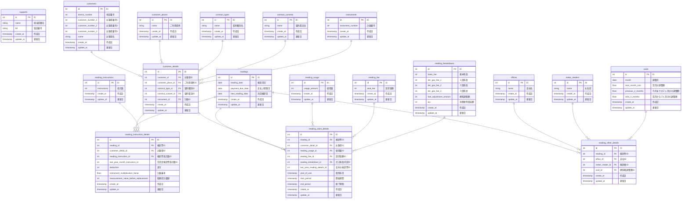

```mermaid
    erDiagram 
        %% 会社（支社）テーブル
        offices {
            int id PK "ID"
            string name "支社名"
            timestamp create_at  "作成日"
            timestamp update_at  "更新日"
        }

        %% 会社カスタマーサポートテーブル
        supports {
            int id PK "ID" 
            string name "担当部署名"
            string tel "電話番号"
            timestamp create_at  "作成日"
            timestamp update_at  "更新日"
        }

        %% お客様テーブル
        customers{
            int id PK "ID"
            int district_number "地区番号"
            int customer_number_1 "お客様番号1"
            int customer_number_2 "お客様番号2"
            int customer_number_3 "お客様番号3"
            string name "お客様名"
            timestamp create_at  "作成日"
            timestamp update_at  "更新日"
        }

        %% ご利用場所
        customer_places{
            int id PK "ID"
            string name "ご利用場所"
            timestamp create_at  "作成日"
            timestamp update_at  "更新日"
        }

        %% 契約種別テーブル
        contract_types{
            int id PK "ID"
            string name "契約種別名"
            timestamp create_at  "作成日"
            timestamp update_at  "更新日"
        }

        %% 契約電流テーブル
        contract_currents {
            int id PK "ID"
            string name "契約電流名"
            timestamp create_at  "作成日"
            timestamp update_at  "更新日"
        }

        %% 計器テーブル
        instruments{
            int id PK "ID"
            int instrument_number "計器番号"
            timestamp create_at  "作成日"
            timestamp update_at  "更新日"
        }

        %% お客様情報詳細テーブル
        customer_details{
            int id PK "ID"
            int customer_id FK "お客様ID"
            int customer_place_id FK "ご利用場所ID"
            int contract_type_id FK "契約種別ID"
            int contract_current_id FK "契約電流ID"
            int instrument_id FK "計器ID"
            timestamp create_at  "作成日"
            timestamp update_at  "更新日"
        }

        %% 検針票テーブル
        readings{
            int id PK "ID"
            date reading_date "検針月日"
            date payment_due_date "支払い期限日"
            date next_reading_date "次回検針日"
            timestamp create_at  "作成日"
            timestamp update_at  "更新日"
        }

        %% 検針票使用量テーブル
        reading_usage{
            int id PK "ID"
            int usage_amount "使用量"
            timestamp create_at "作成日"
            timestamp update_at "更新日"
        }

         %% 検針票請求金額テーブル
        reading_fee{
            int id PK "ID"
            int total_fee "請求金額"
            timestamp create_at  "作成日"
            timestamp update_at  "更新日"
        }

        %% 検針票指示数テーブル
        reading_instructions{
            int id PK "ID"
            int instructions "指示数"
            timestamp create_at  "作成日"
            timestamp update_at  "更新日"
        }

        %% ガス料金内訳
        reading_breakdowns{
            int id PK "ID"
            int basic_fee "基本料金"
            int tier_gas_fee_1 "１段料金"
            int tier_gas_fee_2 "２段料金"
            int tier_gas_fee_3 "３段料金"   
            int fuel_adjustment_amount "燃料調整額"
            int tax "消費税等相当額"
            timestamp create_at  "作成日"
            timestamp update_at  "更新日"
        }
        
        %% 検針票指示数詳細テーブル
        reading_instruction_details{
            int id PK "ID"
            int reading_id FK "検針票ID"
            int customer_detail_id FK "お客様ID"
            int reading_instruction_id FK "検針票指示数ID"
            int last_year_month_instruction_id "先月度検針票指示数ID"
            int deduction "差引"
            float instrument_multiplication_factor "計器乗率"
            int measurement_value_before_replacement "取替前計量値"
            timestamp create_at  "作成日"
            timestamp update_at  "更新日"
        }

        %% 検針票請求詳細テーブル
        reading_claim_details{
            int id PK "ID"
            int reading_id FK "検針票ID"
            int customer_detail_id FK "お客様ID"
            int reading_usage_id FK "使用量ID"
            int reading_fee_id FK "請求金額ID"
            int reading_breakdown_id FK "ガス料金内訳ID"
            int last_year_reading_details_id "去年の検針票ID"
            timestamp year_of_use "使用年月"
            timestamp start_period "開始期間"
            timestamp end_period "終了期間"
            timestamp create_at  "作成日"
            timestamp update_at  "更新日"
        }

        %% 検針員テーブル
        meter_readers{
            int id PK "ID"
            string name "お名前"
            timestamp create_at  "作成日"
            timestamp update_at  "更新日"
        }

        %% 燃料費調整額テーブル
        costs {
            int id PK "ID"
            date month "調整月"
            float next_month_cost "翌月分調整額"
            float previous_2_months "今月までの２ヶ月分の調整額"
            float next_2_months "翌月から２ヶ月分の調整額"
            timestamp create_at  "作成日"
            timestamp update_at  "更新日"
        }

        %% %% 検針票その他情報詳細テーブル
        reading_other_details{
            int id PK "ID"
            int reading_id FK "検針票ID"
            int office_id FK "支社ID"
            int meter_reader_id FK "検針員ID"
            int cost_id FK "燃料費調整額ID"
            timestamp create_at  "作成日"
            timestamp update_at  "更新日"
        }

        customers ||--o{ customer_details: ""
        customer_places ||--o{ customer_details: ""
        contract_types ||--o{ customer_details: ""
        contract_currents ||--o{ customer_details: ""
        instruments ||--o{ customer_details: ""

        readings ||--o{ reading_instruction_details: ""
        customer_details ||--o{ reading_instruction_details: ""
        reading_instructions ||--o{ reading_instruction_details: ""
 
        readings ||--o{ reading_claim_details: ""
        customer_details ||--o{ reading_claim_details: ""
        reading_usage ||--o{ reading_claim_details: ""
        reading_fee ||--o{ reading_claim_details: ""
        reading_breakdowns ||--o{ reading_claim_details: ""

        readings ||--o{ reading_other_details: ""
        offices ||--o{ reading_other_details: ""
        meter_readers ||--o{ reading_other_details: ""
        costs ||--o{ reading_other_details: ""
```
