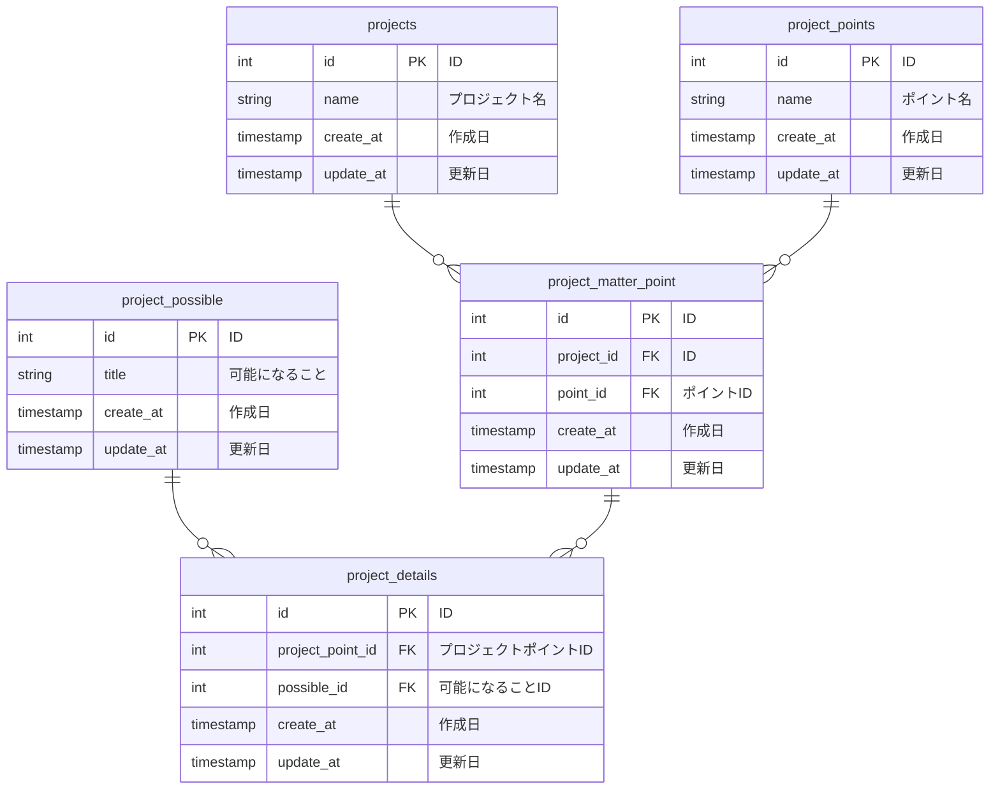

```mermaid
    erDiagram 
        projects{
            int id PK "ID"
            string name "プロジェクト名"
            timestamp create_at  "作成日"
            timestamp update_at  "更新日"
        }
        
        project_points{
            int id PK "ID"
            string name "ポイント名"
            timestamp create_at  "作成日"
            timestamp update_at  "更新日"
        }

        project_possible{
            int id PK "ID"
            string title "可能になること"
            timestamp create_at  "作成日"
            timestamp update_at  "更新日"
        }

        %% 題材とポイントの中間テーブル
        project_matter_point{
            int id PK "ID"
            int project_id FK "ID"
            int point_id FK "ポイントID"
            timestamp create_at  "作成日"
            timestamp update_at  "更新日"
        }

        project_details{
            int id PK "ID"
            int project_point_id FK "プロジェクトポイントID"
            int possible_id FK "可能になることID"
            timestamp create_at  "作成日"
            timestamp update_at  "更新日"
        }

        projects ||--o{ project_matter_point: ""
        project_points ||--o{ project_matter_point: ""
        project_possible ||--o{ project_details: ""
        project_matter_point ||--o{ project_details: ""
```
