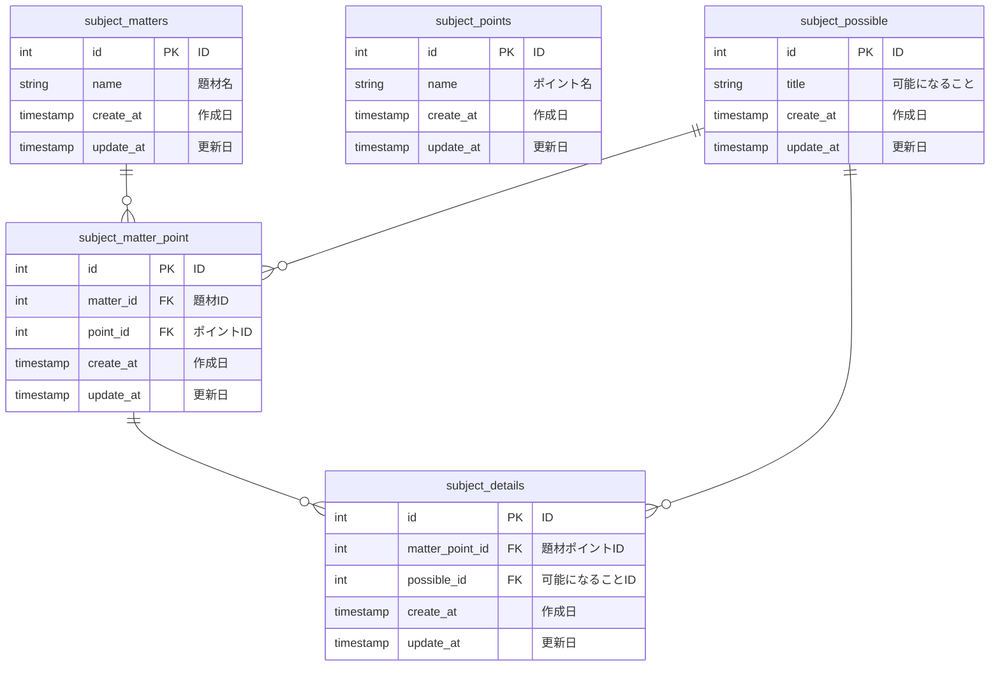

```mermaid
    erDiagram 
        subject_matters{
            int id PK "ID"
            string name "題材名"
            timestamp create_at  "作成日"
            timestamp update_at  "更新日"
        }
        
        subject_points{
            int id PK "ID"
            string name "ポイント名"
            timestamp create_at  "作成日"
            timestamp update_at  "更新日"
        }

        subject_possible{
            int id PK "ID"
            string title "可能になること"
            timestamp create_at  "作成日"
            timestamp update_at  "更新日"
        }

        %% 題材とポイントの中間テーブル
        subject_matter_point{
            int id PK "ID"
            int matter_id FK "題材ID"
            int point_id FK "ポイントID"
            timestamp create_at  "作成日"
            timestamp update_at  "更新日"
        }

        subject_details{
            int id PK "ID"
            int matter_point_id FK "題材ポイントID"
            int possible_id FK "可能になることID"
            timestamp create_at  "作成日"
            timestamp update_at  "更新日"
        }

        subject_matters ||--o{ subject_matter_point: ""
        subject_possible ||--o{ subject_matter_point: ""
        subject_matter_point ||--o{ subject_details: ""
        subject_possible ||--o{ subject_details: ""
```
